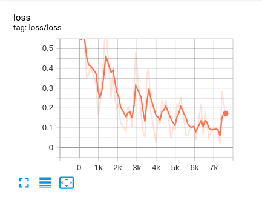
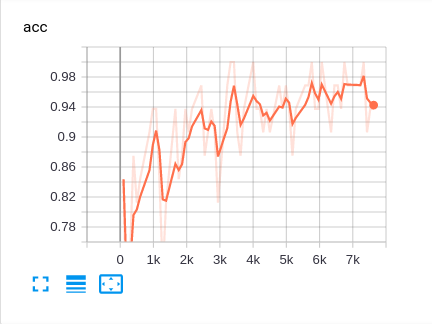
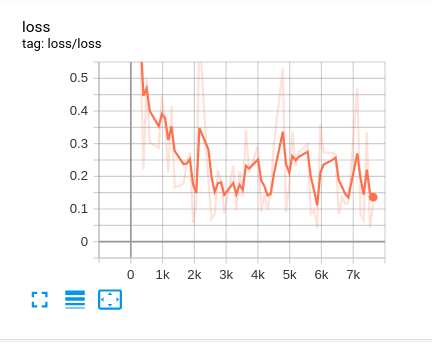
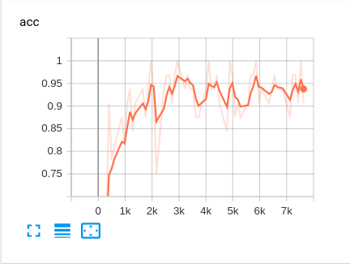

LSTM-IMDB
Try to use lstm to complete sentiment analysis task

## Data
### IMDB
<https://ai.stanford.edu/~amaas/data/sentiment/aclImdb_v1.tar.gz>

### Pretrained Weights
<http://nlp.stanford.edu/data/glove.6B.zip>


## Train Logs
### scratch 
      |  
:-------------------------:|:-------------------------:
Displayed Loss on Tensorboard |  Displayed Accuracy on Tensorboard
```shell script
Epoch 0 : Step 625 => Train Loss: 0.3316 | Train ACC: 0.8438: 100%|██████████| 625/625 [03:53<00:00,  2.68it/s]
Epoch 0 : Step 155 => Val Loss: 0.3394 | Val ACC: 0.8530 
Epoch 1 : Step 625 => Train Loss: 0.2579 | Train ACC: 0.9375: 100%|██████████| 625/625 [03:51<00:00,  2.70it/s]
Epoch 1 : Step 155 => Val Loss: 0.2249 | Val ACC: 0.9085 
Epoch 2 : Step 625 => Train Loss: 0.2569 | Train ACC: 0.9375: 100%|██████████| 625/625 [03:54<00:00,  2.67it/s]
Epoch 2 : Step 155 => Val Loss: 0.1594 | Val ACC: 0.9431 
Epoch 3 : Step 625 => Train Loss: 0.2366 | Train ACC: 0.9062: 100%|██████████| 625/625 [03:54<00:00,  2.66it/s]
Epoch 3 : Step 155 => Val Loss: 0.1417 | Val ACC: 0.9449 
Epoch 4 : Step 625 => Train Loss: 0.0791 | Train ACC: 0.9688: 100%|██████████| 625/625 [03:55<00:00,  2.65it/s]
Epoch 4 : Step 155 => Val Loss: 0.1116 | Val ACC: 0.9583 
Epoch 5 : Step 625 => Train Loss: 0.1854 | Train ACC: 0.9375: 100%|██████████| 625/625 [03:55<00:00,  2.65it/s]
Epoch 5 : Step 155 => Val Loss: 0.1075 | Val ACC: 0.9637 
Epoch 6 : Step 625 => Train Loss: 0.0466 | Train ACC: 0.9688: 100%|██████████| 625/625 [03:56<00:00,  2.64it/s]
Epoch 6 : Step 155 => Val Loss: 0.0861 | Val ACC: 0.9710 
Epoch 7 : Step 625 => Train Loss: 0.0728 | Train ACC: 0.9688: 100%|██████████| 625/625 [03:52<00:00,  2.69it/s]
Epoch 7 : Step 155 => Val Loss: 0.0800 | Val ACC: 0.9726 
Epoch 8 : Step 625 => Train Loss: 0.1130 | Train ACC: 0.9375: 100%|██████████| 625/625 [03:56<00:00,  2.64it/s]
Epoch 8 : Step 155 => Val Loss: 0.0836 | Val ACC: 0.9738 
Epoch 9 : Step 625 => Train Loss: 0.0421 | Train ACC: 1.0000: 100%|██████████| 625/625 [03:56<00:00,  2.64it/s]
Epoch 9 : Step 155 => Val Loss: 0.0759 | Val ACC: 0.9728 
model training has complete
```

### use glove model
      |  
:-------------------------:|:-------------------------:
Displayed Loss on Tensorboard |  Displayed Accuracy on Tensorboard
```shell script
Epoch 0 : Step 625 => Train Loss: 0.5464 | Train ACC: 0.6875: 100%|██████████| 625/625 [03:55<00:00,  2.66it/s]
Epoch 0 : Step 155 => Val Loss: 0.3442 | Val ACC: 0.8586 
Epoch 1 : Step 625 => Train Loss: 0.1659 | Train ACC: 0.9062: 100%|██████████| 625/625 [03:53<00:00,  2.67it/s]
Epoch 1 : Step 155 => Val Loss: 0.2450 | Val ACC: 0.9032 
Epoch 2 : Step 625 => Train Loss: 0.1758 | Train ACC: 0.9062: 100%|██████████| 625/625 [03:53<00:00,  2.67it/s]
Epoch 2 : Step 155 => Val Loss: 0.1878 | Val ACC: 0.9279 
Epoch 3 : Step 625 => Train Loss: 0.0391 | Train ACC: 1.0000: 100%|██████████| 625/625 [03:53<00:00,  2.67it/s]
Epoch 3 : Step 155 => Val Loss: 0.1575 | Val ACC: 0.9423 
Epoch 4 : Step 625 => Train Loss: 0.0295 | Train ACC: 1.0000: 100%|██████████| 625/625 [03:54<00:00,  2.67it/s]
Epoch 4 : Step 155 => Val Loss: 0.1256 | Val ACC: 0.9561 
Epoch 5 : Step 625 => Train Loss: 0.3401 | Train ACC: 0.8438: 100%|██████████| 625/625 [03:53<00:00,  2.67it/s]
Epoch 5 : Step 155 => Val Loss: 0.1105 | Val ACC: 0.9569 
Epoch 6 : Step 625 => Train Loss: 0.1821 | Train ACC: 0.9375: 100%|██████████| 625/625 [03:54<00:00,  2.67it/s]
Epoch 6 : Step 155 => Val Loss: 0.1420 | Val ACC: 0.9467 
Epoch 7 : Step 625 => Train Loss: 0.1633 | Train ACC: 0.9688: 100%|██████████| 625/625 [03:53<00:00,  2.67it/s]
Epoch 7 : Step 155 => Val Loss: 0.1103 | Val ACC: 0.9603 
Epoch 8 : Step 625 => Train Loss: 0.2344 | Train ACC: 0.9062: 100%|██████████| 625/625 [03:54<00:00,  2.67it/s]
Epoch 8 : Step 155 => Val Loss: 0.1095 | Val ACC: 0.9605 
Epoch 9 : Step 625 => Train Loss: 0.1249 | Train ACC: 0.9375: 100%|██████████| 625/625 [03:53<00:00,  2.67it/s]
Epoch 9 : Step 155 => Val Loss: 0.0939 | Val ACC: 0.9675 
model training has complete

```

## TODO

Bidirectional-LSTM 